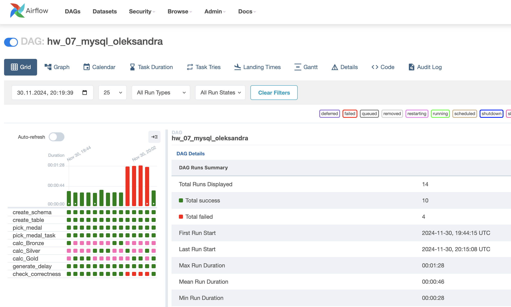
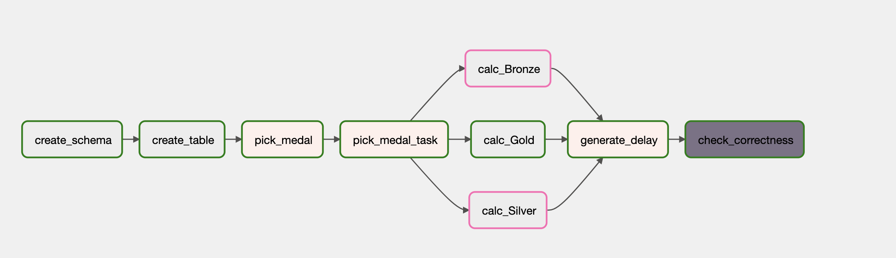
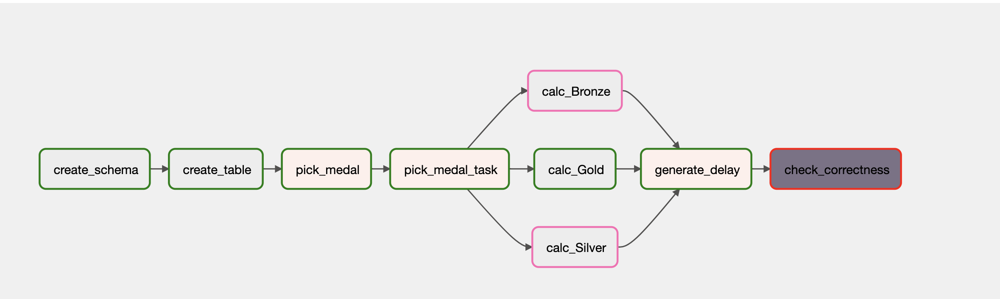
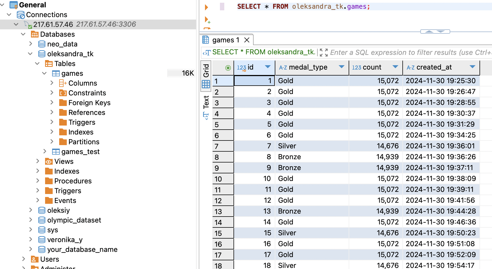

# goit-de-hw-07
Data Engineering. Exploring Apache Airflow's integration with MySQL. Demonstrates DAG execution with branching logic and seamless database interactions.

To create and activate virtual environment and install necessary packages perform the next commands:

```python3.11 -m venv venv

source venv/bin/activate

pip install -r requirements.txt```


To run Apache Airflow UI in docker container:

```docker compose up```

This command will serve Apache Airflow on localhost:8080. You can login with the name "airflow" and password "airflow". You should filter to find hw_07_mysql_oleksandra.

In this task is used private database connection. In case if you want to test another DAGs you can use postgres DB that is running in our container.

The result of hw_07_mysql_oleksandra dug execution is depicted on the screenshot below:



Green bars represents situation when the delay is less than timeout in final task SQLSensor and red ones when the delay is greater.

The correspondent graphs of DAG execution.

We immitate small delay and SQLSensor find the last table entry. The final task and the whole DAG is successfully fulfilled.



Then we set long delay that is greater then sensor timeout and imitate situation when the last table entry is not created within this time period. We observe that the last task fails that cause the failure of the whole DAG.



The database table with final results:


